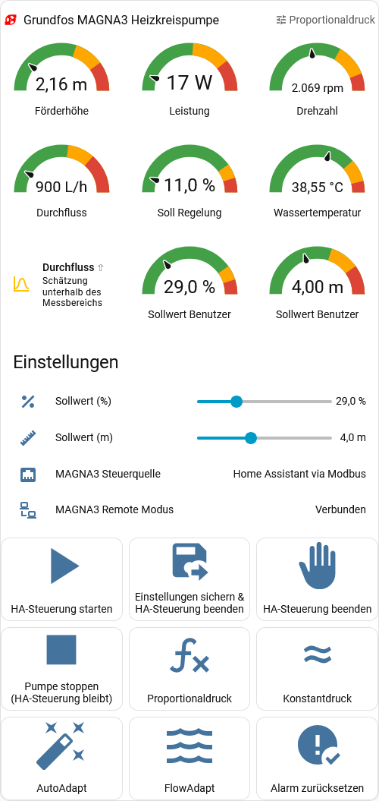

### Grundfos MAGNA3
**Home Assistant Modbus TCP**

<br clear="left"/>

**YAML-Package zur Integration einer Grundfos MAGNA3 Heizkreispumpe in Home Assistant via Modbus TCP (CIM 500 Modul).**

<a href="README.md">English version</a>

---

## Funktionsumfang

- **40+ Sensoren**: Förderhöhe, Durchfluss, Drehzahl, Leistung, Temperaturen, Energieverbrauch, Betriebsstunden, PID-Parameter u.v.m.
- **Status-Bits**: 11 Binary Sensors aus dem Status-Register (Pumpe läuft, Alarm, Warnung, Remote-Modus, ...)
- **Berechnete Werte**: Effizienz, Energiekosten, Sollwert in Meter, Software-Version (BCD-Dekodierung), Alarm-/Warnungstexte
- **Steuerung**: Remote Start/Stop, Regelungsart wechseln (AUTOADAPT, FLOWADAPT, Proportionaldruck), Sollwert setzen (% und Meter)
- **Automationen**: Alarm- und Warnungs-Benachrichtigungen, Hochstrom-Erkennung, ForcedToLocal-Detektor, bidirektionale Sollwert-Synchronisation
- **Dashboard-Karte**: Fertige Lovelace-Karte mit Gauges, Steuerbuttons und Statusanzeigen

## Entitäten-Qualität

Bei der Definition aller Sensoren und Register wurde besonderer Wert auf korrekte und vollständige HA-Metadaten gelegt: `unique_id`, `device_class`, `state_class`, `unit_of_measurement`, `scale`, `precision` und `scan_interval` sind für jede Entität bestmöglich gesetzt. Dadurch funktionieren Langzeitstatistiken, Energiedashboard-Integration und History-Graphen sofort und ohne manuelle Nacharbeit.

## Voraussetzungen

- Home Assistant (beliebige aktuelle Version)
- Grundfos MAGNA3 Pumpe
- Grundfos **CIM 500** Kommunikationsmodul (separat erhältlich, wird in die Pumpe eingebaut und stellt die Modbus TCP Schnittstelle bereit)
- Netzwerkverbindung zwischen HA und CIM 500

## Installation

1. Datei `grundfos_magna3.de.yaml` nach `/config/packages/` kopieren
2. In `configuration.yaml` sicherstellen, dass Packages aktiviert sind:
   ```yaml
   homeassistant:
     packages: !include_dir_named packages
   ```
3. IP-Adresse des CIM 500 anpassen (Zeile 44 in der YAML):
   ```yaml
   host: 192.168.2.7  # ← ANPASSEN: IP-Adresse Deines CIM 500
   ```
4. Home Assistant neu starten

> **Englische Version:** Alle Entitätsnamen, Automationstexte und Kommentare auf Englisch: `grundfos_magna3.yaml` und `dashboard_card.yaml`.

## Dashboard-Karte (optional)

<p align="center">
  
</p>

Die Datei `dashboard_card.de.yaml` enthält eine fertige Lovelace-Karte mit Gauges, Steuerbuttons und Statusanzeigen.

**Verwendung:** Inhalt von `dashboard_card.de.yaml` im Dashboard-Editor als manuelle Karte (YAML) einfügen.

### Erforderliche HACS-Karten

Die Dashboard-Karte benötigt folgende HACS Frontend-Erweiterungen:

| HACS-Karte | Zweck | HACS-Suche |
|---|---|---|
| [**Vertical Stack In Card**](https://github.com/ofekashery/vertical-stack-in-card) | Äußerer Container ohne Rahmen | `vertical-stack-in-card` |
| [**card-mod**](https://github.com/thomasloven/lovelace-card-mod) | CSS-Styling (Rahmen entfernen, Farben) | `card-mod` |
| [**button-card**](https://github.com/custom-cards/button-card) | Steuerbuttons mit Tooltips, Mehrzeilen-Beschriftung und individueller Icon-Größe | `button-card` |
| [**Mushroom**](https://github.com/piitaya/lovelace-mushroom) | Template-Karte für Durchfluss-Status | `mushroom` |

Ohne diese Karten wird die Dashboard-Karte nicht korrekt dargestellt. Die Modbus-YAML selbst funktioniert unabhängig davon.

## Überwachung & Benachrichtigungen

Die Pumpe meldet Probleme selbst über zwei Statusbits in Register 00201 (Bit 10 „Alarm" = rote LED, Bit 11 „Warnung" = orange LED) sowie konkrete Fehlercodes in den Registern 00205 (Alarm) und 00206 (Warnung). Vier vorkonfigurierte Automationen werten das aus und legen entsprechende Benachrichtigungen im HA-Notification-Drawer ab:

| Automation | Auslöser | Was sie meldet |
|---|---|---|
| `magna3_alarm_notification` | Reg 00201 Bit 10 → on | 🚨 Alarm mit Code (Reg 00205) und Klartext (z.B. „Trockenlauf", „Überstrom", „Sensorfehler"). Pumpe schaltet i.d.R. ab |
| `magna3_warning_notification` | Reg 00201 Bit 11 → on | ⚠️ Warnung mit Code (Reg 00206). Pumpe läuft weiter, aber Aufmerksamkeit nötig (z.B. Sensor-Drift, Lager-Service fällig) |
| `magna3_high_current` | Motorstrom > 5 A für 5 Min | ⚠️ Frühindikator für mechanische Probleme — bevor die Pumpe selbst eine Übertemperatur-Abschaltung meldet |
| `magna3_forced_to_local_detected` | Reg 00201 Bit 12 → on | ⚠️ Pumpe wurde von außerhalb von HA in den Lokalmodus gezwungen (Bedienung am Pumpendisplay, Grundfos GO App, Digitaleingang) — HA-Steuerung ist solange nicht möglich |

**Wichtig:** Die Statusregister werden **alle 30 Sekunden** über Modbus gepollt, **unabhängig** davon, ob HA gerade die Pumpe steuert oder die Pumpe lokal läuft. Auch Alarme während rein lokaler Pumpenoperation erreichen also zuverlässig den HA-Notification-Drawer.

**Quittieren:** Aktive Alarme werden über den Dashboard-Button *„Alarm zurücksetzen"* gelöscht (Script `magna3_reset_alarm` — schreibt einen Rising-Edge-Trigger auf Reg 00101 Bit 2). Achtung: Der Reset wirkt nur, wenn die zugrundeliegende Fehlerursache (z.B. Trockenlauf-Bedingung) bereits behoben ist. Warnungen verschwinden hingegen automatisch, sobald die Ursache wegfällt.

**Erweiterung:** Wenn du Push-Notifications aufs Handy willst (statt nur den HA-Drawer), kannst du die jeweilige Automation um eine zweite `action:` mit `notify.mobile_app_<device>` ergänzen. Beispiel:

```yaml
- id: magna3_alarm_notification
  alias: "MAGNA3: Alarm Benachrichtigung"
  trigger:
    - platform: state
      entity_id: binary_sensor.magna3_alarm
      to: 'on'
  action:
    - action: persistent_notification.create
      data:
        title: "🚨 MAGNA3 Alarm"
        message: "Code: {{ states('sensor.magna3_alarm_code') }} ({{ states('sensor.magna3_alarm_text') }})"
    - action: notify.mobile_app_dein_handy   # ← anpassen oder ganz weglassen
      data:
        title: "🚨 MAGNA3 Alarm"
        message: "Code: {{ states('sensor.magna3_alarm_code') }} ({{ states('sensor.magna3_alarm_text') }})"
```

## Registerübersicht

### Messwerte (Read-Only)

| Register | Sensor | Einheit | Intervall |
|---|---|---|---|
| 00201 | Status-Bits (11 Binary Sensors) | Bitfeld | 30s |
| 00202 | Prozess-Rückmeldung | % | 30s |
| 00301 | Förderhöhe | m | 15s |
| 00302 | Durchfluss | m³/h | 15s |
| 00303 | Relative Leistung | % | 15s |
| 00304 | Drehzahl | rpm | 15s |
| 00305 | Frequenz | Hz | 15s |
| 00308 | Sollwert (aktuell) | % | 30s |
| 00309 | Motorstrom | A | 30s |
| 00310 | DC-Link Spannung | V | 30s |
| 00312-13 | Leistungsaufnahme | W | 15s |
| 00321 | Elektronik-Temperatur | K | 15s |
| 00322 | Medientemperatur | K | 15s |
| 00326 | Spez. Energieverbrauch | Wh/m³ | 300s |
| 00327-28 | Betriebsstunden (laufend) | h | 300s |
| 00329-30 | Betriebsstunden (gesamt) | h | 300s |
| 00332-33 | Energieverbrauch | kWh | 300s |
| 00334-35 | Anzahl Starts | - | 300s |
| 00338 | Sollwert (Benutzer) | % | 15s |
| 00339 | Differenzdruck | bar | 30s |
| 00357-58 | Gepumptes Volumen | m³ | 300s |

### Steuerregister (Read-Write)

| Register | Funktion | Werte |
|---|---|---|
| 00101 | Control Register | Bit 0: Remote, Bit 1: On/Off, Bit 2: Reset |
| 00102 | Regelungsart | 6=Proportional, 128=AUTOADAPT, 129=FLOWADAPT |
| 00104 | Sollwert | 0-10000 (= 0-100%) |

### Optionale Register (auskommentiert)

Die YAML enthält weitere Register als auskommentierte Blöcke:
- **00105** RelayControl (nicht relevant für MAGNA3)
- **00110-00112** PID-Parameter (Kp, Ti, Regelrichtung) — **nur für Experten!**
- **00316** Remote-Drucksensor
- **00320** Remote-Temperatursensor
- **00352-00356** Wärmeenergie (bei externem Temperatursensor)

## Individuelle Anpassungen

### Strompreis

In der YAML sollte der Wert `0.30` für die Energiekostenberechnung dem eigenen Strompreis angepasst werden:
```yaml
state: >
  {{ (states('sensor.magna3_energieverbrauch') | float(0) * 0.30) | round(2) }}
  # ↑ Strompreis anpassen!
```

### Scan-Intervalle

Die Intervalle sind konservativ gewählt (15-300s). Bei Bedarf können sie angepasst werden. Zu aggressive Intervalle (< 5s) können die Modbus-Kommunikation belasten.

## Dokumentation

Basiert auf dem offiziellen Grundfos Modbus-Dokument:
[**98367081 05.2025 — Modbus for Grundfos pumps** (PDF)](https://api.grundfos.com/literature/Grundfosliterature-6012947.pdf)

## Mitmachen

Fragen, Fehlerberichte und Verbesserungsvorschläge sind jederzeit willkommen! Nutze die [GitHub Discussions](https://github.com/TRON4R/ha-grundfos-magna3-modbus/discussions) oder erstelle ein [Issue](https://github.com/TRON4R/ha-grundfos-magna3-modbus/issues).

## Lizenz

[MIT](LICENSE)
